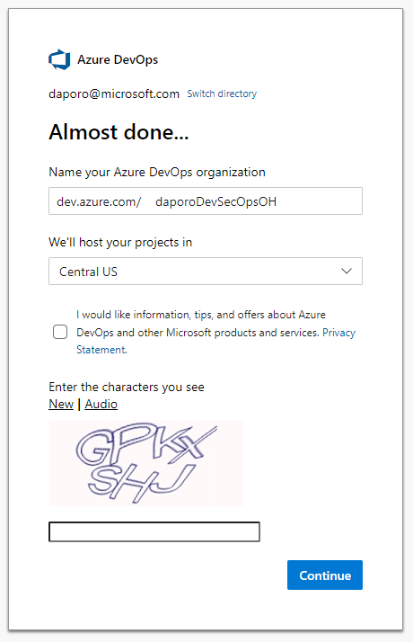
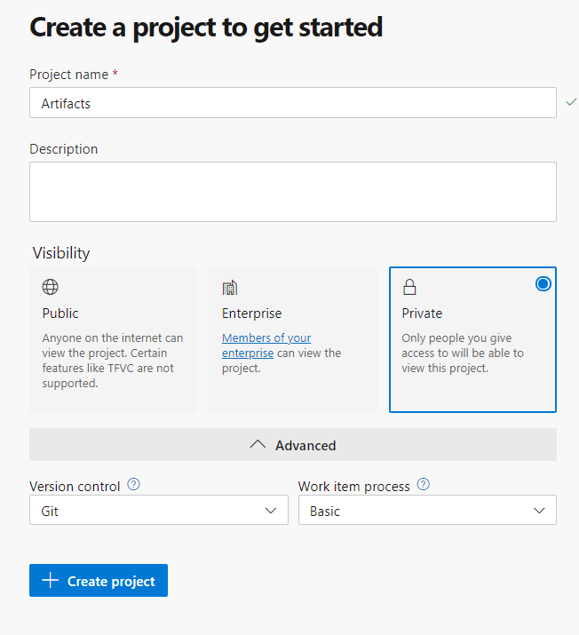
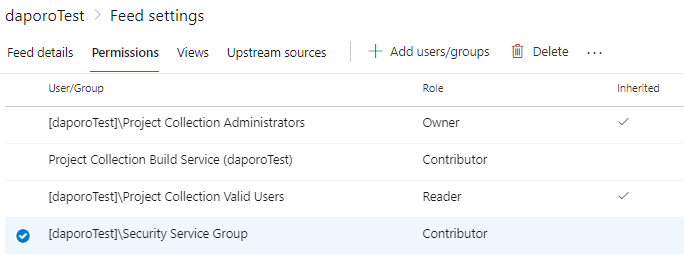
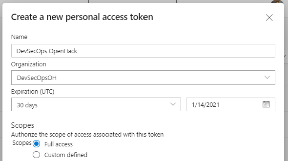
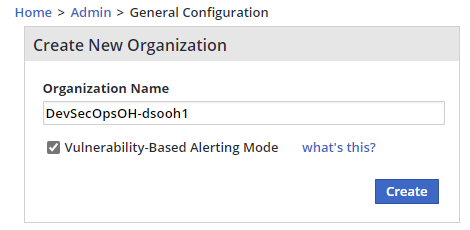
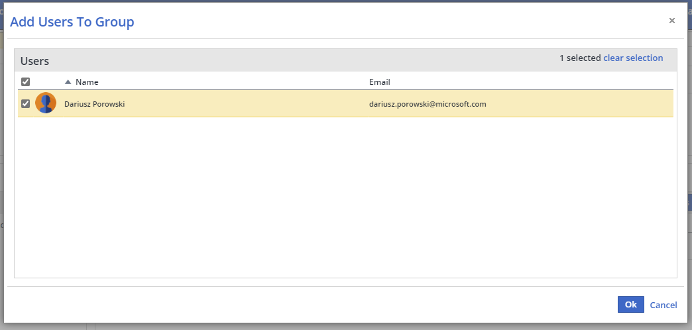

# Retired as of June 30, 2021: DevSecOps OpenHack deployment script

This script deploys and configures all the resources your team will need in order to complete the challenges during the OpenHack. These resources:

* **Deployed to Opsgility Subscription**
  * Azure Key Vault
  * Azure Container Registry
  * App Service
  * App Service Plan
  * Virtual Machine running Aqua

* **Deployed to Microsoft Azure DevOps Organization**
  * Azure DevOps Project

## How to deploy lab env

### Preprequisites

* Linux/WSL - provisioning scrips are using Bash
* jq - the jq command line processor (`sudo apt-get install jq`)
* Azure CLI - with JSON as the default output format (`az configure`)

### High Level Overview

1. Az Login to Opsgility subscription

2. Provision Azure Resources in Opsgility subscription

3. Az Login using your MSFT Account

4. Prepare Personal Access Token (PAT) for Azure DevOps

5. Deploy Azure DevOps project

6. Assign Attendees to Projects

7. Save your work

### 1. Az Login to Opsgility/Internal Subscription

Using the one of the credentials provided by Opsgility, execute an AZ Login (For testing you can either your internal subscription or MSDN subscription)

```bash
#For Opsgility use
az login -u <username> -p '<password>'

#For Internal or MSDN use (Will take you to browser to complete sign-in)
az login
```

### 2. Provision the Azure Resources in Opsgility/Internal subscription

This assumes you are in the root of repo. On Windows ensure that all scripts use the LF line endings after cloning (easy to change in VS Code).

```bash
./provision_azure_resources.sh -l <location> -n <teamName> -t <teamNumber>
```

Example: Provision the infrastructure for dsooh1 team.

```bash
./provision_azure_resources.sh -l centralus -n dsooh -t 1
```

Once this script completes, two files will be present in the scripts directory. They are acr.json and subscription.json. These files contain information needed during the provisioning of DevOps resources in step 4. Do not delete them. Keeping a copy of these files after the provisioning has completed will save time during some of the challenges by making information quickly available to the team.

> NOTE! If the resources are not delivered correctly, remove the resource group from your subscription first, and then try again.
> Before you run once again, you have to purge Key Vault by running this command: az keyvault purge --subscription <subscriptionId> -n <teamName><teamNumber>kv
> 
> If you have only issues with Aqua VM provisioning, then run only provision_aquavm.sh script.
> ./provision_aquavm.sh -l <location> -n <teamName> -t <teamNumber>


### 3. Provision Azure DevOps organization

1. Create a new Azure DevOps organization [docs](https://docs.microsoft.com/en-us/azure/devops/organizations/accounts/create-organization)

  

2. Create a private project in Azure DevOps called Artifacts [docs](https://docs.microsoft.com/en-us/azure/devops/organizations/projects/create-project)

  

3. Go to Artifacts section inside the Artifacts project, and next select settings of the default feed - it should a be name of your ADO org.

4. In the **Feed settings** add **[adoOrgName]\Security Service Group** group into permissions with a **Contributor** role  [docs](https://docs.microsoft.com/en-us/azure/devops/artifacts/feeds/feed-permissions?view=azure-devops#adding-usersgroups-permissions-to-a-feed)

  

### 4. Prepare Personal Access Token (PAT) for Azure DevOps

Personal Access Token is required to configure Project, Git repo, Pipelines, assign access, etc. To get PAT, please follow below steps:

1. Go to https://dev.azure.com/adoOrgName/_usersSettings/tokens, and click **New Token**.

2. Fill out Name for your token (e.g. DevSecOps OpenHack), and select **Full acces** under **Scopes** section.

    

3. Save your Token for later use in the next sectios (4. Deploy Azure DevOps project & 5. Assign Attendees to Project).

    

### 5. Deploy Azure DevOps project

Provision the DevOps project by running the script below. You will pass the same team number, and PAT created in previous section.

```bash
./provision_devops.sh -n <teamName> -t <teamNumber> -o <adoOrgName> -s '<personalAccessToken>'
```

Example: Provision the project for dsooh1 team.

```bash
./provision_devops.sh -n dsooh -t 1 -o DevSecOpsOH -s 'lqqmlixfx5sgfsfguu7bhsv5uggsdhjfkuhkhlljlkh2yyfgklsa'
```

### 6. Assign Attendees to Project

Finally, collect aliases of all Attendees. You will pass the same team number, and a **comma-separated list** of emails for users that should be assigned into the project.

```bash
./assign_attendees.sh -u <CommaSeparatedUserEmails> -n <teamName> -t <teamNumber> -o <adoOrgName> -s '<personalAccessToken>'
```

Example: Assign access to ADO project for Dariusz Porowski and Richard Guthrie who are in dsooh1 team.

```bash
./assign_attendees.sh -u daporo@microsoft.com,rguthrie@microsoft.com -n dsooh -t 1 -o DevSecOpsOH -s 'lqqmlixfx5sgfsfguu7bhsv5uggsdhjfkuhkhlljlkh2yyfgklsa'

```

### 7. Save your work

Keep the `<teamName>_subscription.json` and `<teamName>_acr.json` files you will need them in Challenge 1.

### 8. Prepare WhiteSource

1. Create a new WhiteSource organization dedicated only for your Team.

   1. Go to [Admin](https://saas.whitesourcesoftware.com/Wss/WSS.html#!adminOrganization) section, select [General Configuration](https://saas.whitesourcesoftware.com/Wss/WSS.html#!adminOrganization_generalConfig), and click [Create New Organization](https://saas.whitesourcesoftware.com/Wss/WSS.html#!addNewOrganization).

   2. Use this naming pattern for teh new WS org: <adoOrgName>-<teamName><teamNumber> example: DevSecOpsOH-dsooh1

      

2. Invite team members to your WS org.

   1. Go to [Admin](https://saas.whitesourcesoftware.com/Wss/WSS.html#!adminOrganization) section, select [Users](https://saas.whitesourcesoftware.com/Wss/WSS.html#!adminOrganization_users) and click **Invite Users**. Make sure **Send email to newly created/invited users** is checked.

      

3. Assign permissions to WS org members.
   
   1. Go to [Admin](https://saas.whitesourcesoftware.com/Wss/WSS.html#!adminOrganization) section, select [Groups](https://saas.whitesourcesoftware.com/Wss/WSS.html#!adminOrganization_groups) and click **Add Users** (Make sure **admins** group is selected).
   
   2. Select all invited users, and click **OK**. 

      
